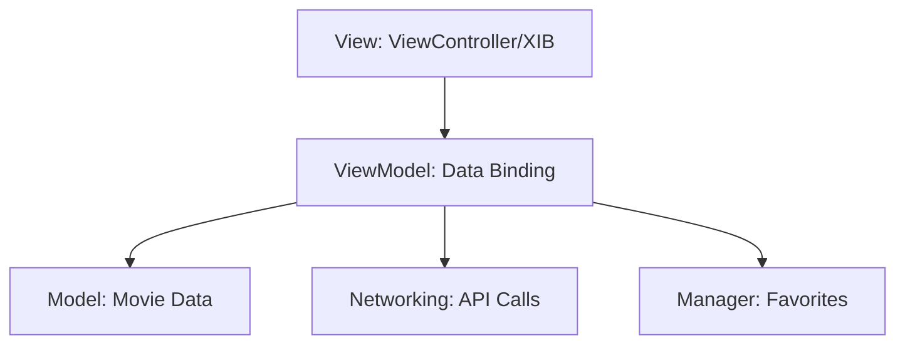

# Trending Movies 🎬


A modern, elegant iOS application built with **UIKit** that allows users to discover trending movies worldwide. The app features a high-end UI design with smooth animations, custom-themed components, and persistent favorites management.

---

## ✨ Features

- **Trending Dashboard**: Browse the latest movies from TMDB API with a sophisticated card-based UI.
- **Dynamic Ratings**: Movie scores are color-coded (Green/Orange/Red) for quick visual assessment.
- **Animated Launch**: A custom-built, bounce-animated splash screen for a premium feel.
- **MovieDetails**: Detailed information including plot overviews, release dates, and high-quality posters.
- **Favorites System**: Heart-based persistence to keep track of your must-watch movies.
- **Modern UI/UX**: Built with shadows, custom gradients, and refined typography.

---

## 📸 Screenshots

| ☀️ Light Mode | 🌙 Dark Mode | ❤️ Movie Details |
|:---:|:---:|:---:|
|  |  |  |

---

## 🛠️ Tech Stack & Architecture

- **Language**: Swift 5.10
- **Framework**: UIKit (Programmatic UI & XIBs)
- **Architecture**: MVVM (Model-View-ViewModel)
- **Image Loading**: [SDWebImage](https://github.com/SDWebImage/SDWebImage)
- **Networking**: URLSession with custom API abstraction
- **Persistence**: UserDefaults / JSON Encoding



---

## 🚀 Getting Started

### Prerequisites

- Xcode 15+
- iOS 15.0+
- TMDB API Key (already configured in the project)

### Installation

1. Clone the repository:
   ```bash
   git clone git@github.com:Mustafa-Nour/Trending-Movie-ios-app-uikit.git
   ```
2. Open the project:
   ```bash
   cd "MVVM Practice (Movie app)"
   open "MVVM Practice (Movie app).xcodeproj"
   ```
3. Build and Run (**Cmd + R**) to experience the animation!

---

## 📄 License

This project is licensed under the MIT License - see the [LICENSE](LICENSE) file for details.

---

<p align="center">Made with ❤️ by <a href="https://github.com/Mustafa-Nour">Mustafa Nour</a></p>
